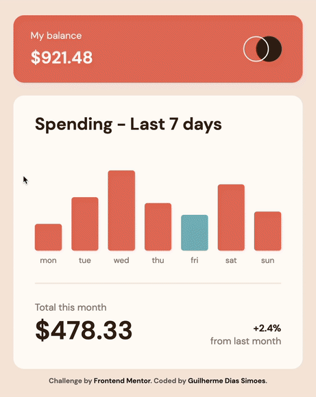

# Frontend Mentor - Expenses chart component solution

This is a solution to the [Expenses chart component challenge on Frontend Mentor](https://www.frontendmentor.io/challenges/expenses-chart-component-e7yJBUdjwt). Frontend Mentor challenges help you improve your coding skills by building realistic projects.

## Table of contents

-   [Overview](#overview)
    -   [The challenge](#the-challenge)
    -   [Screenshot](#screenshot)
    -   [Links](#links)
-   [My process](#my-process)
    -   [Built with](#built-with)
    -   [What I learned](#what-i-learned)
    -   [Continued development](#continued-development)
    -   [Useful resources](#useful-resources)
-   [Author](#author)

## Overview

### The challenge

Users should be able to:

-   View the bar chart and hover over the individual bars to see the correct amounts for each day
-   See the current day’s bar highlighted in a different colour to the other bars
-   View the optimal layout for the content depending on their device’s screen size
-   See hover states for all interactive elements on the page
-   **Bonus**: Use the JSON data file provided to dynamically size the bars on the chart

### Screenshot



### Links

-   Solution URL: <https://github.com/gdsimoes/expenses-chart-component/>
-   Live Site URL: <https://gdsimoes.github.io/expenses-chart-component/>

## My process

### Built with

-   Figma
-   Flexbox
-   DOM Manipulation
-   JSON
-   [Sass (SCSS)](https://styled-components.com/) - CSS extension language

### What I learned

This is a simple website, but I used this opportunity to learn new techniques and try different things.

It's my first project in a while using **Sass**, and my main reason for doing so is that I wasn't satisfied with the number of `calc` calls I had to write in my previous project. With **Sass**, I can have something like this:

```scss
font-size: ((15 * 100)/375) * 1vw;
```

and it gets compiled to:

```css
font-size: 4vw;
```

I also tried a different approach to responsive design for larger screens. Instead of using relative units like `em`, `rem`, and `vw`, I mostly used `px` and the `transform` property to scale my design to the correct size. This approach made my workflow more straightforward, and with the time I saved, I could pay a lot of attention to details, like animations when the graph is populated and when the mouse goes over the graph bars.

Finally, I used **JavaScript** to read the **JSON** file and dynamically populate the graph. Changing this code to read the data from an actual database would be trivial.

### Continued development

I am still not 100% satisfied with how I create responsive websites. In my future projects, I plan to explore the scaling technique I used, making my code more readable and efficient.

### Useful resources

-   [MDN - Working with JSON](https://developer.mozilla.org/en-US/docs/Learn/JavaScript/Objects/JSON) - I worked with **JSON** before, but I had to remember a few things, and everything I needed was in this article.
-   [Stack Overflow - How can I change the thickness of my `<hr>` tag](https://stackoverflow.com/questions/4151743/how-can-i-change-the-thickness-of-my-hr-tag) - The `hr` element has some strange behaviour, and the answers to this question helped me deal with that.
-   [MDN - Window: resize event](https://developer.mozilla.org/en-US/docs/Web/API/Window/resize_event) - When I tried using `transform` to scale my design, I realized I had to use **JavaScript** because the `calc` function cannot divide two lengths. This article helped me use the resize event to get the needed results.
-   [MDN - Using data attributes](https://developer.mozilla.org/en-US/docs/Learn/HTML/Howto/Use_data_attributes) - I used data attributes to send the data from the JSON file to the HTML code. It was my first time doing this, and this article helped me develop a simple solution.

## Author

-   Website - <https://gdsimoes.com>
-   Frontend Mentor - [@gdsimoes](https://www.frontendmentor.io/profile/gdsimoes)
-   LinkedIn - [Guilherme Dias Simoes](https://www.linkedin.com/in/gdsimoes)
